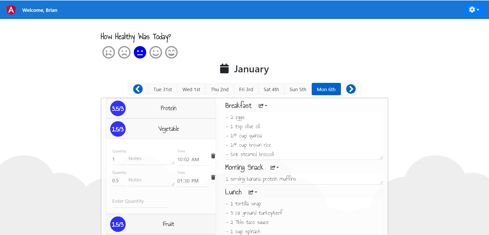

# NudgeDsktop

This project was generated with [Angular CLI](https://github.com/angular/angular-cli) version 8.3.21.

## Why was this project created?

Nudge Coach is a mobile-only nutrition tracking application that allows dietitians to keep track of their clients progress. There are a few reasons why this application becomes a burden to use:
- The performance is unsatisfactory and often erratic (i.e. takes 20-30 seconds to load the interface.)
- The formatting does not allow for optimal tracking (i.e. sections only allow 256 chars, and no new line characters are allowed.)
- Navigating around to other text areas takes multiple user clicks.
- The list goes on...

## What was done to improve upon the Nudge Coach experience?

This Angular CLI project is a browser based application that boasts the following improvements:
- Because this is a browser-based and optimized for desktop, users can type more detailed messages at a faster rate.
- Auto-tabbing when adding new Counter values allows for better User Experience.
- Advanced formatting has been implemented (i.e. new line '/r/n', unlimited characters, auto-expanding text-areas).
- Advanced copying was implemented
    - Copy a meal from one day to another.
    - Remember your counter values so Protein, Starches, etc. automatically get copied.
    - Quick Copy remembers your common meals and allows for a one-click action to add a meal.
- The loading times have been improved from ~30seconds to < 5seconds.
- Allows adding meals to future dates to make meal planning easier.

## A visual comparison of the improvements

A look at the mobile Nudge Coach app demonstrates many of the constraints of this mobile app.

Below is a look at the Nudge-Dsktop application. One change immediately noticeable is the amount of the data the user is able to take in at a glance.

## How can I use this?

You can visit the site: https://brianushman.github.io/nudge-dsktop/
However, because this is an unauthorized application that builds on top of the Nudge Coach data API. You will need to install an HTTP packet sniffer to find out your personal API Key/Token to use to login.

## Development server

Run `ng serve` for a dev server. Navigate to `http://localhost:4200/`. The app will automatically reload if you change any of the source files.

## Code scaffolding

Run `ng generate component component-name` to generate a new component. You can also use `ng generate directive|pipe|service|class|guard|interface|enum|module`.

## Build

Run `ng build` to build the project. The build artifacts will be stored in the `dist/` directory. Use the `--prod` flag for a production build.

## Running unit tests

Run `ng test` to execute the unit tests via [Karma](https://karma-runner.github.io).

## Running end-to-end tests

Run `ng e2e` to execute the end-to-end tests via [Protractor](http://www.protractortest.org/).

## Further help

To get more help on the Angular CLI use `ng help` or go check out the [Angular CLI README](https://github.com/angular/angular-cli/blob/master/README.md).
